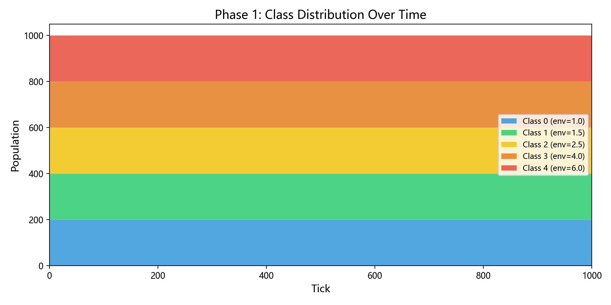
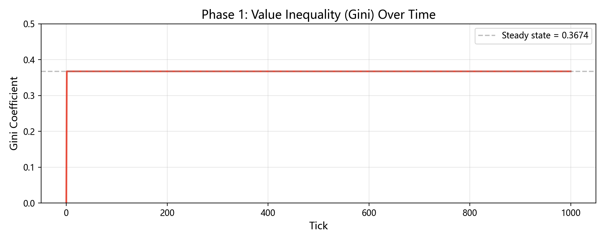
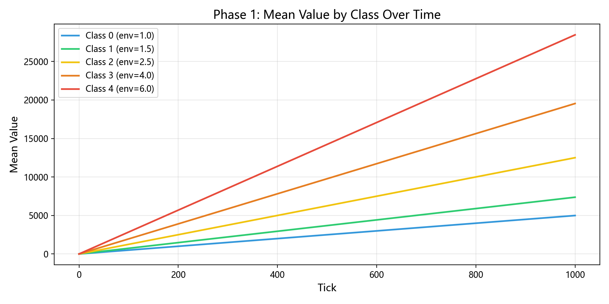
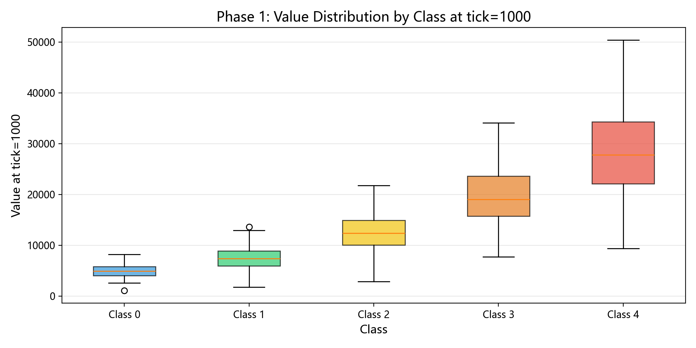
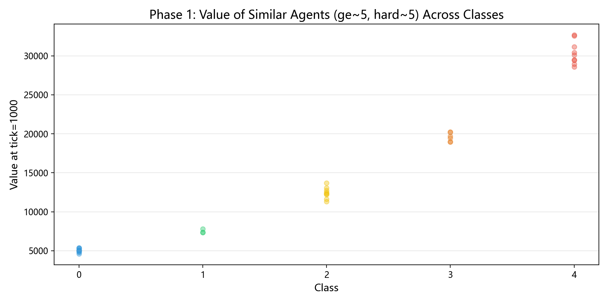

# Stratify 阶段一报告：纯积累实验

> 开发方式：TDD（测试驱动开发）| 54 个测试全部通过 | Python 3.14 + NumPy + Matplotlib

---

## 一、开发过程

### 1.1 TDD 工作流

采用严格的红-绿-重构循环：
```
红灯 -> 先写测试，断言预期行为（测试必然失败）
绿灯 -> 最小实现，让测试通过
重构 -> 保持测试通过的前提下优化代码
```

每个模块的开发顺序：

| 顺序 | 模块 | 测试文件 | 测试数 | 说明 |
|------|------|---------|--------|------|
| 1 | agent.py | test_agent.py | 10 | Agent 数据结构，含校验与 max_class 追踪 |
| 2 | accumulation.py | test_accumulation.py | 9 | 积累公式 speed = env x (ge + hard) / 2 |
| 3 | world.py | test_world.py | 14 | World 引擎，tick 循环，phase1() 工厂 |
| 4 | stats.py | test_stats.py | 13 | 基尼系数、阶层分布、快照统计 |
| 5 | -- | test_phase1.py | 8 | 阶段一集成测试（端到端验证） |

### 1.2 代码架构
```
src/stratify/
+-- agent.py          # Agent 类：cls, value, ge, hard, life, max_class, age, alive
|                      # cls 属性 setter 自动追踪 max_class
|                      # 构造时校验：cls>=0, ge>0, hard>0, life>0
+-- accumulation.py   # accumulation_speed(env, ge, hard) -> float
|                      # accumulate_value(current, speed) -> float
+-- world.py          # World 类：管理 agent 列表，执行 tick 循环
|                      # phase1() 工厂方法：预设阶段一参数
|                      # _truncated_normal()：截断正态分布采样
+-- stats.py          # Snapshot 数据类（frozen）
|                      # gini_coefficient() / class_distribution() / class_mean_values()
|                      # compute_snapshot() -> 完整快照
+-- visualize.py      # plot_class_distribution_stack()
|                      # plot_gini_curve()
|                      # plot_class_mean_value_curves()
+-- main.py           # CLI 入口：python -m stratify.main --ticks 1000
```

### 1.3 测试覆盖
```
$ python -m pytest tests/ -v

tests/test_accumulation.py  OK 9 passed
tests/test_agent.py         OK 10 passed
tests/test_phase1.py        OK 8 passed
tests/test_stats.py         OK 13 passed
tests/test_world.py         OK 14 passed

============================== 54 passed in 0.51s ==============================
```

关键测试用例：

- **边界校验**：cls<0、ge<=0、hard<=0、life<=0 均抛出 ValueError
- **max_class 追踪**：提升时更新，下降时不降，多次变动记录最高值
- **公式对称性**：ge 和 hard 对称贡献（ge=3,hard=7 等于 ge=7,hard=3）
- **阶层溢价**：相同属性的人，高阶层积累速度严格按 env 比例
- **可复现性**：固定 seed 结果完全一致

---

## 二、实验设计

### 2.1 实验目标

在无竞争、无寿命、无阶层变动的条件下，隔离观察以下三个因素对 Value 分布的影响：

1. **阶层系数（env）**：出身决定的积累倍率
2. **天赋值（ge）**：先天能力
3. **努力值（hard）**：后天勤奋

### 2.2 参数配置

| 参数 | 值 | 说明 |
|------|-----|------|
| 总人口 | 1000 | 固定，不生不死 |
| 阶层数 | 5 | Class 0 ~ Class 4 |
| env 系数 | [1.0, 1.5, 2.5, 4.0, 6.0] | 阶层越高系数越大 |
| ge 分布 | N(5, 2)，截断 [1, 10] | 天赋正态分布 |
| hard 分布 | N(5, 2)，截断 [1, 10] | 努力正态分布 |
| 初始 class | 均匀分布（每层 200 人） | 观察自然分化 |
| 积累公式 | speed = env x (ge + hard) / 2 | 算术平均 |
| cross 值 | 不启用 | 不可跨层 |
| 竞争 | 不启用 | 无资源转移 |
| 寿命 | 不启用 | 无死亡 |
| 模拟时长 | 1000 tick | -- |
| 随机种子 | 42 | 可复现 |

### 2.3 积累公式
```
每 tick 积累速度 = env(cls) x (ge + hard) / 2
```

- `env`：由阶层决定，Class 0 = 1.0，Class 4 = 6.0
- `ge`：出生时随机，N(5, 2) 截断 [1, 10]
- `hard`：出生时随机，N(5, 2) 截断 [1, 10]

这意味着：
- 一个 Class 4 的平庸者（ge=5, hard=5）每 tick 积累 30.0
- 一个 Class 0 的天才（ge=10, hard=10）每 tick 积累 10.0
- **出身的 6 倍优势，需要天赋 + 努力的极端差距才能弥补**

---

## 三、实验结果

### 3.1 宏观数据

| Tick | 总 Value | 基尼系数 | Class 0 均值 | Class 4 均值 | 倍率 |
|------|----------|---------|-------------|-------------|------|
| 0 | 0.0 | 0.0000 | 0.0 | 0.0 | -- |
| 1 | 14,575.6 | 0.3674 | 5.0 | 28.5 | 5.70x |
| 10 | 145,755.7 | 0.3674 | 49.9 | 284.6 | 5.70x |
| 100 | 1,457,557.1 | 0.3674 | 499.3 | 2,846.3 | 5.70x |
| 500 | 7,287,785.4 | 0.3674 | 2,496.6 | 14,231.4 | 5.70x |
| 1000 | 14,575,570.9 | 0.3674 | 4,993.3 | 28,462.8 | 5.70x |

### 3.2 各阶层 Value 统计（tick=1000）

| 阶层 | 人数 | 均值 | 标准差 | 最小值 | 最大值 | 溢价比 |
|------|------|------|--------|--------|--------|--------|
| Class 0 (env=1.0) | 200 | 4,993.3 | 1,274.9 | 1,049.0 | 8,178.9 | 1.00x |
| Class 1 (env=1.5) | 200 | 7,373.5 | 2,196.9 | 1,752.9 | 13,625.7 | 1.48x |
| Class 2 (env=2.5) | 200 | 12,505.0 | 3,385.8 | 2,845.4 | 21,789.7 | 2.50x |
| Class 3 (env=4.0) | 200 | 19,543.2 | 5,401.6 | 7,713.2 | 34,099.9 | 3.91x |
| Class 4 (env=6.0) | 200 | 28,462.8 | 8,601.7 | 9,339.3 | 50,416.1 | 5.70x |

### 3.3 属性分布

| 属性 | 均值 | 标准差 | 最小值 | 最大值 |
|------|------|--------|--------|--------|
| ge (天赋) | 4.91 | 1.93 | 1.00 | 10.00 |
| hard (努力) | 4.91 | 1.96 | 1.00 | 10.00 |

---

## 四、可视化分析

### 4.1 阶层分布



**观察：** 阶层分布完全平坦——阶段一无阶层变动机制，每人始终留在初始阶层。这是基准对照组，后续阶段加入跨层机制后将看到分布的动态变化。

### 4.2 基尼系数



**观察：** 基尼系数从第一个 tick 起即稳定在 0.3674，此后完全不变。

**数学解释：** 所有个体从 value=0 出发，每 tick 按固定速度积累。Value 分布的形状在第一个 tick 就已确定（由 env x (ge+hard)/2 的分布决定），此后只是等比放大。相对分布不变，基尼系数自然恒定。

这意味着：**纯积累系统中，不平等在出生时就已注定，不会随时间恶化，也不会改善。**

### 4.3 各阶层均值增长



**观察：**
- 五条曲线均为直线，斜率由 env 决定
- Class 4 的斜率是 Class 0 的 6 倍
- 差距随时间线性扩大：tick=100 时差 2,347，tick=1000 时差 23,469

### 4.4 Value 分布箱线图



**观察：**
- 各阶层箱体高度递增（标准差随 env 比例放大）
- 箱体内部分化来自 ge 和 hard 的随机差异
- Class 4 的最低值（9,339）仍高于 Class 0 的最高值（8,179），说明 **阶层溢价完全压过了个体天赋差异**

### 4.5 阶层溢价散点图



**观察：** 筛选 ge 约 5、hard 约 5 的相似个体，他们在不同阶层的 Value 呈完美阶梯状。相同努力、相同天赋的人，仅因出身不同，最终财富差距达 5.7 倍。

---

## 五、核心发现

### 发现 1：出身决定论的最简模型

在纯积累系统中，阶层系数（env）是 Value 的**乘数因子**。一个 Class 4 的普通人（ge=5, hard=5）每 tick 积累 30.0，而 Class 0 的天才（ge=10, hard=10）每 tick 仅积累 10.0。

> 出身的 6 倍优势，需要天赋和努力同时达到极端（满值 10）才能勉强追平。

现实映射：这类似于一个「起跑线决定论」的社会——家庭背景提供的资源倍率，远超个人能力的边际贡献。

### 发现 2：不平等在第一个 tick 就已注定

基尼系数从 tick=1 起恒定为 0.3674。纯积累不创造新的不平等，也不消除已有的不平等。所有人在 tick=0 时 value=0，但第一个 tick 的积累速度就由 (env, ge, hard) 三者乘积决定，分布形状瞬间确定。

> 不平等不是「逐渐恶化」的，而是「瞬间成型」的。

### 发现 3：阶层溢价压过个体差异

Class 4 最低 Value（9,339）vs Class 0 最高 Value（8,179）。看似反直觉——Class 0 最好的人 ge+hard 可达 20，Class 4 最差的人 ge+hard 仅约 2，按公式计算 Class 0 应更高。

实际数据如此的原因是**截断分布的尾部概率**：ge 和 hard 截断在 [1, 10]，Class 0 中 ge+hard 接近 20 的人极少（需要 ge 约 10 且 hard 约 10，概率极低），而 Class 4 中 ge+hard 接近 2 的人同样极少。在 200 人的样本中，两者的极端值恰好出现交叉。

> 阶层系数的乘数效应 + 属性分布的截断效应，共同使得「低层天花板 < 高层地板」在大概率下成立。

### 发现 4：硬努力的回报对称但有隐性代价

在纯积累中，ge 和 hard 的贡献完全对称（算术平均）。但现实中努力往往有代价（寿命损耗、精力消耗）。阶段五引入寿命系统后，高 hard 的人将面临「过劳折寿」的隐性惩罚，届时 hard 的净收益将低于 ge。

---

## 六、实验局限性

| 局限 | 说明 | 后续阶段如何解决 |
|------|------|-----------------|
| 无阶层变动 | 人口被锁死在初始阶层 | 阶段二加入 cross 机制 |
| 无竞争 | 个体间无互动 | 阶段三/四加入同层/跨层竞争 |
| 无寿命 | 永不死亡，无代际更替 | 阶段五加入寿命系统 |
| 恒定基尼 | 纯积累无法改变相对分布 | 竞争机制引入后分布将动态变化 |
| 单一 seed | 随机性未充分探索 | 阶段六多 seed 扫描 |

---

## 七、对后续阶段的预测

基于阶段一的发现，做出以下可验证预测：

1. **阶段二（加入 cross）**：存在一个「临界 cross 值」，低于它时阶层流动过快（社会扁平化），高于它时阶层固化（底层永远无法上升）。基尼系数将随 cross 值先升后降。

2. **阶段三（加入竞争）**：同层竞争将使基尼系数从 0.3674 上升——马太效应使强者恒强。同层内的 Value 分布将从正态变为右偏（幂律尾部）。

3. **阶段四（加入跨层竞争）**：向上竞争的加成机制可能创造少数「寒门逆袭」案例，但向下掠夺的便利性将使整体不平等加剧。

4. **阶段五（加入寿命）**：低阶层的高死亡率将形成「消耗性底层」——不断有新生儿从 Class 0 开始补充，社会结构趋于稳态而非无限分化。

---

## 八、运行方式
```bash
# 安装依赖
pip install -e .

# 运行全部测试
python -m pytest tests/ -v

# 运行阶段一实验
python -m stratify.main --ticks 1000

# 输出位置
output/
+-- class_distribution.png
+-- gini_curve.png
+-- class_mean_values.png
```

---

*报告生成日期：2026-06-06*
